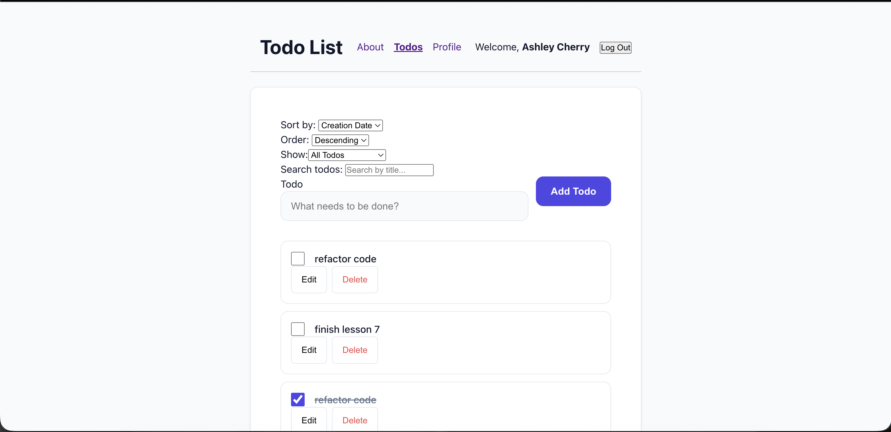
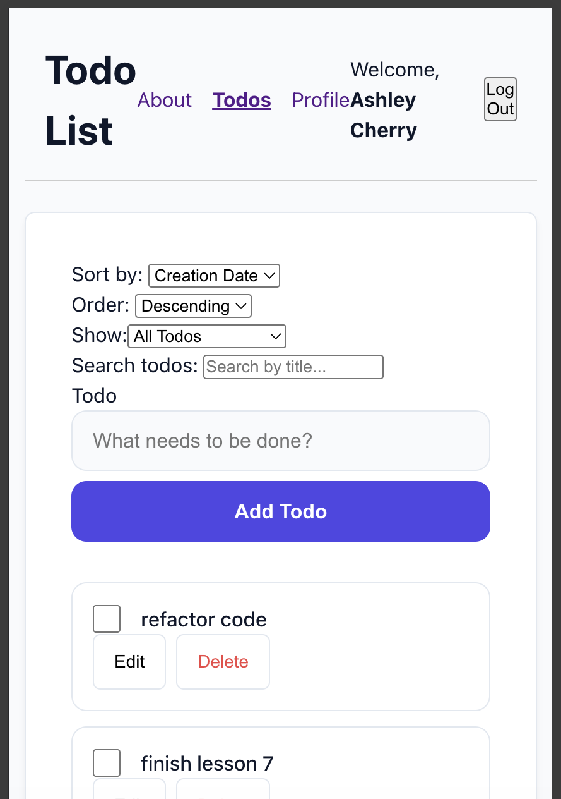

# Secure Task Tracker (React Todo Application)

A modern, highly optimized workflow manager built with React. This application transforms a standard task tracker into a robust, portfolio-worthy project featuring client-side sanitization, strict form validations, dynamic theme design tokens, and responsive layouts designed for any device size.

## 💻 How to View the Project (Local Preview)

Since this application is optimized for local exploration, you can download and spin up the complete interactive development server on your machine in under two minutes:

1. **Clone the repository:**
   ```bash
   git clone [https://github.com/AshCherr96/ashley-cherry-todo-list.git](https://github.com/AshCherr96/ashley-cherry-todo-list.git)
   cd ashley-cherry-todo-list

2. Install project dependencies:

npm install

3. Configure environment values:
Create a .env file in your root folder and add the API endpoint: VITE_TARGET=[https://ctd-learns-node-l42tx.ondigitalocean.app](https://ctd-learns-node-l42tx.ondigitalocean.app)

4. Launch the application engine:

npm run dev

Now, open http://localhost:5173 in your web browser to interact with the full app!

------------------------------------------------------------------------------------

📸 Screenshots
Desktop View: 


Mobile View: 

-------------------------------------------------------------------------------------

✨ Features List
Full CRUD Lifecycle: Create, Read, Update (inline editing hooks), and Delete task rows effortlessly.

URL-Based Status Filtering: Dynamic React Router v7 integration to seamlessly sort items between All, Active, and Completed tabs via the browser navigation stack.

Advanced State Pipelines: Complete task state processing driven by a centralized useReducer and Context state hub.

XSS Input Sanitization: Real-time character scrubbing using DOMPurify to sanitize strings safely before memory storage state commits.

Fully Accessible & Responsive UI: 100% compliant touch targets (minimum 44px target heights) and adaptive layout columns built for small mobile screens.

---------------------------------------------------

🛠️ Technologies Used
Core Library: React 18 (Functional Architecture)

Routing System: React Router v7

Build Engine & Dev Server: Vite + ESBuild

Styling Architecture: Option A: Scoped CSS Modules

Security & Data Sanitization: DOMPurify

----------------------------------------------------

⚙️ Available Scripts
Inside this project path directory, you can execute these standard npm runtime actions:

npm run dev: Boots up the local Vite engine with hot-module reloading active.

npm run build: Compiles, optimizes, and minifies your application assets into a production-ready /dist bundle.

npm run preview: Launches a local server environment to test and preview your compiled build bundle locally before running actual deployment hooks.

--------------------------------------------------

🎨 Design Decisions
Scoped Styling via CSS Modules: Selected to eliminate global namespace pollution entirely. Class names are uniquely scoped per component block wrapper, guaranteeing style modularity.

Unified Token Layout Palette: Implemented consistent color design tokens (--primary, --surface, --text-muted) to ensure clear contrast rules, clean readability hierarchies, and custom micro-interactive focus boundaries.

Mobile-First Targets: Leveraged flexible flexbox grid architectures and forced strict minimum button dimensions of 44px to pass modern tactile click criteria on hand-held layouts.

----------------------------------------------------------------------

🔮 Future Improvements
Production Web Hosting: Setting up build triggers to deploy a live, public instance on Vercel or Netlify.

Extended Local Database Storage: Integrating native user profiling cache syncs directly with permanent persistent browser structures.

Drag-and-Drop Prioritization: Enabling intuitive, tactile drag handlers to visually re-arrange task priority records on the fly.

------------------------------------------------------------

📄 License Information
Distributed under the MIT License. See LICENSE for more details.

-----------------------------------------------------------------

📬 Contact Information
Developer Name: Ashley Cherry

GitHub Repository Hub: [AshCherr96 Profile](https://github.com/AshCherr96)